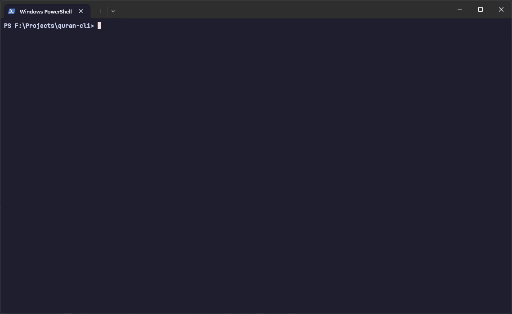

# Quran CLI 📖

A beautiful, high-performance Terminal User Interface (TUI) for reading the Quran, built with Rust and Ratatui. Designed for developers and terminal enthusiasts who want a distraction-free reading experience.

Built with ❤️ by [Mahim](https://github.com/notMahim24)



## ✨ Features

- **🚀 Fast Navigation**: Browse through all 114 Surahs with a real-time reactive interface.
- **📖 Scripture Pane**: Beautifully formatted English translation with Quranic text.
- **🔍 Live Search**: Instant full-text search across the entire Quran with **word highlighting**.
- **🎨 Themes**: Multiple curated color palettes:
  - `Slate` (Classic Dark)
  - `Emerald` (Nature Green)
  - `Sand` (Warm Desert)
  - `Night` (Deep OLED Black)
- **📏 Responsive**: Adapts to any terminal size with automatic text wrapping and scroll capping.
- **🔌 Offline First**: All data is bundled in the binary—no internet connection required.

## 📥 Installation

### For Users (Binary Download)

The easiest way to get started is to download the pre-built binary for your operating system:

1. Go to the [Releases](https://github.com/notMahim24/Q-cli/releases) page.
2. Download the version for your system (`windows`, `linux`, or `macos`).
3. Extract and run the `quran` binary.

### For Developers (Build from Source)

Ensure you have [Rust](https://www.rust-lang.org/tools/install) installed.

```bash
# Clone the repository
git clone https://github.com/notMahim24/quran-cli
cd quran-cli

# Build and install
cargo install --path .
```

## 🚀 Usage

### Terminal User Interface (TUI)

Simply run the command to open the interactive browser:

```bash
quran
```

**Keybindings:**

- `h/l` or `Left/Right`: Switch between Surah list and Scripture.
- `j/k` or `Up/Down`: Navigate through Surahs or scroll verses.
- `/`: Open Search mode.
- `t`: Cycle through themes.
- `Esc` or `q`: Quit.

### CLI Commands

- **Search**: `quran search "mercy"`
- **Read**: `quran read 2:255`
- **Random**: `quran random`

## 🛠️ Tech Stack & Credits

- **Rust**: Language
- **Ratatui**: TUI Framework
- **Crossterm**: Terminal backend
- **Serde**: Data serialization

Special thanks to the [whoisyurii](https://github.com/whoisyurii/christ-cli) project for the original TUI inspiration and structural patterns.

## 📄 License

Licensed under the [MIT License](LICENSE).
